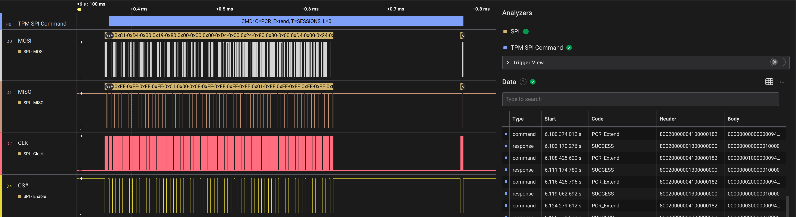

# TPM SPI Command

A Saleae Logic 2 High-Level Analyzer (HLA) extension for parsing TPM SPI command/response. This HLA is built upon [TPM SPI Transaction](https://github.com/WithSecureLabs/bitlocker-spi-toolkit/tree/c04105672905dfdc51cf04c722bd9c06baa4a8d4/TPM-SPI-Transaction).

Supports TPM 1.2 and TPM 2.0.

## Screenshot

## Note/注記

This extension is intended for research purposes only.

この拡張機能は研究用途のみに使用されることを意図して提供されています。
